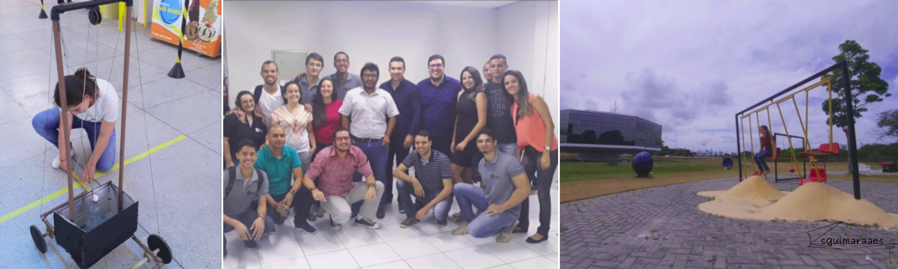

# eng_computacao-ufersa

Neste repositório encontram-se os principais projetos que desenvolvi durante minha graduação em engenharia de computação na UFERSA. Os projetos variam na utilização de programas com linguagem C ou C++, automação com o microcontrolador Atmega 328p, modelagem 3D com o Inventor da Autodesk.

### base-lancamento-com-arco-para-foguete-pet

Base de lançamento para lançamento de foguete PET com variação angular do lançamento em arco e acionamento eletromecânico. Disponibilizado o arquivo em .pdf (publicação na revista Física na Escola) com instruções sobre o projeto e o código para o microcontrolador Atmega 328p.

### base-lancamento-com-reducao-torque-para-foguete
Base de lançamento para lançamento de foguete PET com variação angular do lançamento também em arco, mas com técnicas de redução de torque e novas novas implementações eletromecânicas com automação para acionamento e injeção do combustível no foguete. Disponibilizado o arquivo em .pdf com instruções sobre o projeto (publicação no Anais do I POCKET - ECOP) e o código para o microcontrolador Atmega 328p.

### codigo-linguagemC-centro-de-massa
Código em linguagem C para calcular o centro de massa de um foguete com modelagem conforme a descrição no texto do artigo. Disponibilizado o arquivo em .pdf com instruções sobre o projeto e o código desenvolvido em linguagem C para calcular o centro de massa de um foguete. 

### ensino-movimento-curvilineo
Kit elaborado para bancada com impressão 3D, técnicas de carpintaria e corte a laser para o lançamento de foguetes com elásticos de escritório gerando a força propulsora. Além disso, implementou-se também automação com sensores e atuadores diversos. Disponibilizado o arquivo em .pdf (TCC na íntegra) com instruções sobre o projeto, o arquivo fritzing com a montagem dos componentes eletrônicos, o código para o microcontrolador Atmega 328p e os componentes 3D desenvolvidos com o inventor.

### multicronometro-baixo-custo
Multicronômetro de baixo custo com impressão 3D e automação com o sensor LRD e laser. Disponibilizado o arquivo em .pdf (apresentação no SNEF 2019) com instruções sobre o projeto, incluindo o código para o microcontrolador Atmega 328p no texto. Além disso, é disponibilizado o projeto 3D para a contução do multicronômetros.

### panorama-4g-brasil

Análise da tecnologia 4G diante da sua evolução e arquitetura com a descrição da distribuição desta no Brasil com os dados disponibilizados pelo portal [Teleco](https://www.teleco.com.br/). Disponibilizado o arquivo em .pdf do artigo, os arquivos .csv com os dados e o arquivo .ipynb da análise feita com python em um notebook do Colab.

### sistema-tolerante-a-falhas-hardware

Sistema com diferentes modelos de sensores de temperadores para simular um sistema de hardware tolerante a falhas. Disponibilizado o arquivo em .pdf com instruções sobre o projeto, o arquivo fritzing com a montagem dos componentes eletrônicos e o código para o microcontrolador Atmega 328p.
